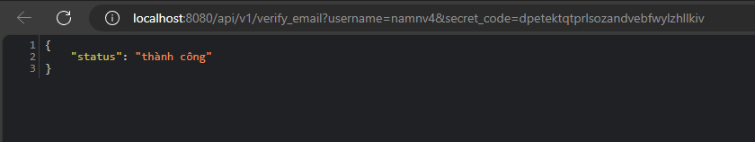

<!-- # Ý tưởng
- 1 App ví điện tử (go-wallet)
- monolithic: gồm api gateway, wallet (manage transaction), account(manage balance and account)
- API 
	- tạo tk có gửi OTP qua email
	- login
	- lấy ra thông tin tài khoản theo token
	- Lấy ra danh sách các tài khoản gợi ý người nhận theo dữ liệu người dùng nhập (user_name hoặc số điện thoại)
	- api chuyển tiền xử lý chuyển tiền async qua kafka. (add case high workload and case fail) and idempotence
	- search lịch sử chuyển khoản (ngày từ ... đến ..., theo số stk người nhận)
	- nạp tiền: hold ở BE timeoout chờ call API fake to confirm through kafka -->

<details>

# Setup
## postgres

```txt
1. download image

	docker pull postgres:16.3-alpine

2. run container

	docker run --name postgres -e POSTGRES_USER=root -e POSTGRES_PASSWORD=secret -e POSTGRES_DB=wallet -p 5432:5432 -d postgres:16.3-alpine
```

## sqlc

```txt
1. Download sqlc binary

	go install github.com/sqlc-dev/sqlc/cmd/sqlc@latest

2. confile file `sql.yaml`
3. run command

	sqlc generate

```
</details>

# This is a basic wallet was implemented by Golang.

# Technologies

	1. sqlc - "https://github.com/sqlc-dev/sqlc"
	2. golang-migrate - "github.com/golang-migrate/migrate/v4"
	3. migration - "github.com/rubenv/sql-migrate" or "github.com/golang-migrate/migrate/v4/database/postgres"
	4. kafka - "github.com/IBM/sarama"
	5. jwt - "github.com/golang-jwt/jwt"
	6. paseto - "github.com/o1egl/paseto"
	7. asynq - "github.com/hibiken/asynq"
	8. email - "github.com/jordan-wright/email"
	9. DB transaction - "github.com/jackc/pgx/v5/pgxpool"


# Feature

	1. Login with jwt or paseto with session to renew token
	2. Get all accounts of user
	3. Create new user (send email link to confirm)
	4. Create new account
	5. Find account by username of phone
	6. Transfer money between 2 accounts (with confirm result through kafka)
	7. Get history of transfer money

# How to run
## Run with docker

	1. docker compose up
	2. Call API to migrate DB `http://localhost:8080/migration`

## Run with normal

	1. Modify docker compose `- KAFKA_CFG_ADVERTISED_LISTENERS=PLAINTEXT://127.0.0.1:29092` and comment `api-service:`
	2. run `docker compose up` to setup kafka, redis and postgres
	3. `make server`
	4. Call API to migrate DB `http://localhost:8080/migration`

Database


Demostration


# How to config email for sender

After 2-steps login. Create app password and change data in `app.env` field `EMAIL_SENDER_PASSWORD` 

[link](https://myaccount.google.com/u/4/apppasswords?pli=1&rapt=AEjHL4PmLMVdSC8MbVUW0FEhGc4AH0Ei7xN8neQqQWaM06zvWdXl4skrdWhGtoFBI8ezAnAyLrKa0q8vrHytgfy5MiKZoUfoO_J3pmzPJRzST3T_OqM0LhM)



