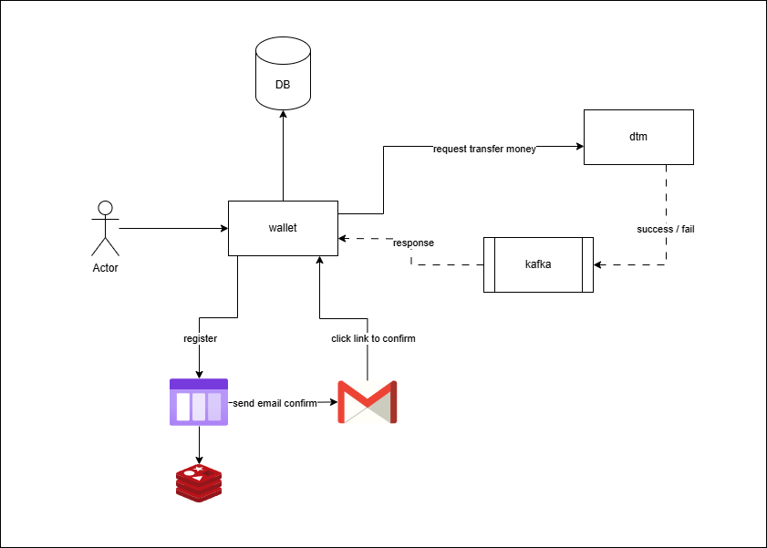
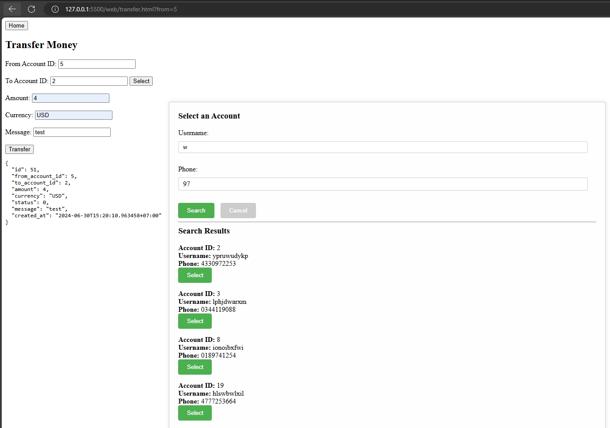
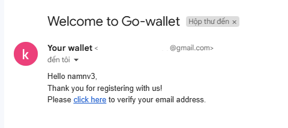

<details>

## sqlc

```txt
1. Download sqlc binary

	go install github.com/sqlc-dev/sqlc/cmd/sqlc@latest

2. confile file `sql.yaml`
3. run command

	sqlc generate

```
</details>

# This is a basic online wallet implemented by Golang with TCC pattern. The project includes: Authorization, distributed task queue, send email, and transfer money.

# Technologies

	1. sqlc - "https://github.com/sqlc-dev/sqlc"
	2. golang-migrate - "github.com/golang-migrate/migrate/v4"
	3. migration - "github.com/rubenv/sql-migrate" or "github.com/golang-migrate/migrate/v4/database/postgres"
	4. kafka - "github.com/IBM/sarama"
	5. jwt - "github.com/golang-jwt/jwt"
	6. paseto - "github.com/o1egl/paseto"
	7. asynq - "github.com/hibiken/asynq"
	8. email - "github.com/jordan-wright/email"
	9. DB transaction - "github.com/jackc/pgx/v5/pgxpool"
	10. TCC - "github.com/dtm-labs/dtm"




## TCC flow


# Features

	1. Login with jwt or paseto with session to renew token
	2. Get all accounts of user
	3. Create new user (send email link to confirm)
	4. Create new account
	5. Find account by username of phone
	6. Transfer money between 2 accounts (with confirm result through kafka)
	7. Get history of transfer money

# How to run
<!-- ## Run with docker

	1. docker compose up
	2. Call API to migrate DB `http://localhost:8080/migration` -->

## Run with normal

	1. open cmd in current directory
	2. run `docker compose up` to setup kafka, redis and postgres
	3. go to `cd ./dtm` and run `go run main.go`
	4. go to `cd ./wallet` and run `make server`
	5. Call API to migrate DB `http://localhost:8080/migration`

## Demostration




# How to config email for sender

After 2-steps login. Create app password and change data in `app.env` field `EMAIL_SENDER_PASSWORD` 

[link](https://myaccount.google.com/u/4/apppasswords?pli=1&rapt=AEjHL4PmLMVdSC8MbVUW0FEhGc4AH0Ei7xN8neQqQWaM06zvWdXl4skrdWhGtoFBI8ezAnAyLrKa0q8vrHytgfy5MiKZoUfoO_J3pmzPJRzST3T_OqM0LhM)





